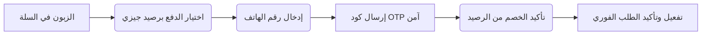

# 💼 ملف مقترح الشراكة الاستراتيجية: الدفع برصيد الهاتف (DCB) مع جيزي (Djezzy)
### منصة "كلش هنا" (Kolch Hna) للتجارة الإلكترونية متعددة البائعين

---

## 1. الملخص التنفيذي (Executive Summary)
منصة **"كلش هنا" (Kolch Hna)** هي منصة تجارة إلكترونية مبتكرة بنظام البرمجيات كخدمة (SaaS) موجهة خصيصاً للسوق الجزائري، تتيح للآلاف من التجار المحركين للمقاولات الصغيرة والمتوسطة (SMEs) إنشاء متاجرهم الإلكترونية المتكاملة خلال دقائق. 

نظراً لأن العقبة الكبرى للتجارة الإلكترونية في الجزائر هي **الدفع الإلكتروني** ونقص انتشار البطاقات البنكية، فإننا نقترح شراكة استراتيجية مع **جيزي (Djezzy)** لدمج نظام **الدفع المباشر عبر رصيد الهاتف (Direct Carrier Billing - DCB)**. يتيح هذا النظام للمشتركين الشراء الفوري من آلاف المتاجر والدفع مباشرة من رصيد Flexy الخاص بهم، مما يحقق طفرة مالية واقتصادية للطرفين.

---

## 2. المشكلة القائمة في السوق الجزائري (The Problem)

| المشكلة | تأثيرها على التجار والزبائن | تأثيرها على شركات الاتصالات |
| :--- | :--- | :--- |
| **الاعتماد الكلي على الدفع عند الاستلام (COD)** | يسبب معدلات رفض عالية جداً للطلبات (تتراوح بين 25% إلى 35%)، وتجميد لرأس مال البائع بسبب تأخر شركات التوصيل في تسليم الأموال. | بقاء حركة الأموال خارج النظام الرقمي الرسمي لشركات الاتصالات. |
| **تدني نسبة الشمول المالي للبطاقات** | بطاقات CIB والذهبية لا تزال تعاني من بطء في الانتشار وصعوبة استخدامها لدى شريحة الشباب والنساء. | فقدان الفرصة للاستحواذ على حصة من سوق المدفوعات اليومية الصغيرة والمتوسطة. |
| **احتكار بوابات الدفع التقليدية** | صعوبة اندماج صغار التجار في بوابات الدفع البنكية لتعقيد الإجراءات البيروقراطية والضمانات المطلوبة. | بعد قطاع الاتصالات عن قيادة التغيير الرقمي الحقيقي للتجار والشركات الناشئة. |

---

## 3. الحل المقترح: الدفع برصيد جيزي (The Solution)
تحويل رصيد جيزي (Airtime/Flexy) من مجرد وسيلة لإجراء المكالمات والاشتراك في الإنترنت إلى **محفظة مالية رقمية مصغرة** لشراء المنتجات المادية والخدمات من منصة "كلش هنا".



### الميزات الأساسية للنظام المطور:
- **تحقق ثنائي آمن (OTP 2FA)** لحماية رصيد المستخدمين من السرقة أو الاحتيال.
- **تأكيد فوري وديناميكي لأهلية السلة والتاجر** قبل طلب الخصم لضمان استقرار المعاملات.
- **تحديد سقف يومي وسقف لكل طلب** لحماية رصيد المستخدمين وإدارة المخاطر الائتمانية.

---

## 4. الفوائد والمكاسب الاستراتيجية لجيزي (Value Proposition for Djezzy)

### 📈 أ. خلق مصدر إيرادات جديد وضخم (New Revenue Stream)
ستحصل جيزي على نسبة مئوية (Transaction Fee) من كل عملية بيع تتم عبر المنصة. بافتراض وجود 5,000 تاجر نشط بمعدل 5 طلبات يومياً بمتوسط قيمة 2,000 دج، فإن حجم المعاملات السنوي يقارب مبالغ ضخمة، مما يجعل العمولة المحصلة من عمليات الدفع مصدراً هاماً للأرباح الصافية.

### 🔋 ب. زيادة وتيرة شحن الرصيد (ARPU Boost)
لإتمام المشتريات، سيقوم المستخدمون بشحن رصيدهم (Flexy) بمبالغ أكبر وتكرار أعلى. هذا يزيد مباشرة من متوسط العائد لكل مستخدم (ARPU) ويسرع من دوران النقدية لدى شبكة وكلاء جيزي.

### 🤝 ج. قيادة الشمول المالي ودعم الـ Startups
من خلال تمكين صغار التجار من استخدام رصيد جيزي لاستلام أموالهم، تساهم جيزي مباشرة في خطة الدولة للتحول الرقمي والشمول المالي وتدعم المقاولين الذاتيين وأصحاب المشاريع المصغرة.

### 🔐 د. الولاء والتثبيت لشبكة المشتركين (Customer Retention)
تحول شريحة SIM الخاصة بجيزي إلى أداة مالية لا غنى عنها في الحياة اليومية للمشترك يزيد بشكل كبير من ولاء الزبون ويمنع انتقاله للمنافسين.

---

## 5. النموذج المالي المقترح لتوزيع الحصص (Financial Split Model)
نقترح آلية توزيع ذكية وتلقائية مبنية على العقود الذكية للخصم:

```
[ خصم قيمة الطلب بالكامل من رصيد الهاتف للزبون ]
                      │
                      ▼
 ┌──────────────────────────────────────────────┐
 │                  بوابة جيزي                  │
 └──────────────────────┬───────────────────────┘
                        │
       ┌────────────────┴────────────────┐
       ▼                                 ▼
[ نسبة جيزي للتشغيل: 3% ]          [ صافي المبلغ: 97% ]
                                         │
                        ┌────────────────┴────────────────┐
                        ▼                                 ▼
            [ عمولة منصة كلش هنا: 5% ]           [ حصة التاجر: 92% ]
```

*ملاحظة: النسب أعلاه قابلة للتفاوض التجاري المباشر بين الطرفين.*

---

## 6. البنية التقنية وآلية الربط الآمن (Technical Architecture)
منصتنا مبنية بأحدث معايير الأمان وتستخدم نظام قواعد بيانات متطور مدعوم بسياسات حماية صارمة على مستوى الأسطر (RLS)، مما يضمن عدم تداخل المعاملات بين التجار.

### متطلبات الربط مع API جيزي:
1. **Endpoint لبدء المعاملة (Charge Initiation)**: إرسال الطلب مع رقم الهاتف والمبلغ للحصول على معرف المعاملة (Transaction ID).
2. **Endpoint لإرسال/التحقق من الـ OTP**: للتحقق التلقائي من أن صاحب الهاتف هو من يقف خلف الطلب.
3. **Endpoint لتنفيذ الخصم الفعلي (Commit Charge)**: لخصم المبلغ بعد التأكد من صحة الرمز.
4. **Endpoint لإلغاء المعاملة (Refund/Void)**: في حال إلغاء الزبون أو التاجر للطلب في فترته المحددة.

---

## 7. خطة العمل المقترحة لبدء التعاون (Action Plan)

1. **الخطوة الأولى: تقديم العرض التجاري (Commercial Pitch)**
   عقد اجتماع مع قطاع تطوير الأعمال والخدمات الرقمية بجيزي (B2B / Digital Services Department).
   
2. **الخطوة الثانية: توقيع اتفاقية تجريبية (NDA & Sandbox Access)**
   توقيع اتفاقية سرية معلومات للوصول لبيئة الاختبار (Sandbox) لربط الـ API الخاص بنا مع نظامهم التجريبي.

3. **الخطوة الثالثة: الإطلاق التجريبي (Soft Launch)**
   إطلاق الخدمة لعدد محدد من التجار المميزين في المنصة لتأكيد استقرار البنية التحتية وحركة الأموال.

4. **الخطوة الرابعة: الحملة التسويقية المشتركة (Co-Marketing)**
   إعلان الشراكة بشكل رسمي عبر منصات جيزي ومواقع التواصل لدعم التجار ودعوة الزبائن للشراء الفوري.