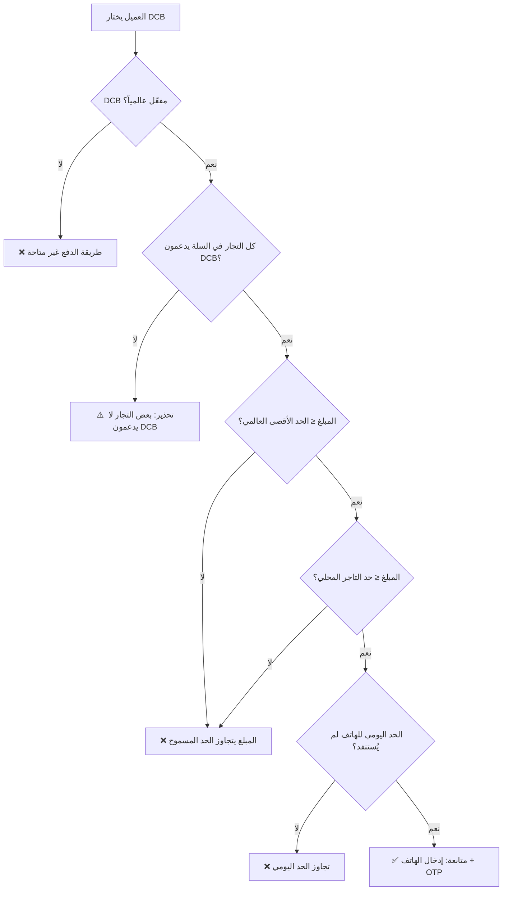

# 🔧 خطة تنفيذ نظام الدفع عبر رصيد الهاتف (DCB - Direct Carrier Billing)

تهدف هذه الخطة لبناء نظام دفع عبر رصيد الهاتف (Flexy / Airtime) متكامل داخل منصة **كلش هنا** متعددة التجار، مع تطبيق منطق تحكم ثنائي المستوى (Admin ↔ Vendor) وإدارة شاملة للمعاملات.

---

## متطلبات المراجعة من المستخدم

> [!IMPORTANT]
> يرجى مراجعة النقاط التالية والموافقة قبل البدء في التنفيذ:
> 1. **نموذج محاكاة DCB**: بما أنه لا يوجد مزود DCB حقيقي (مثل Ooredoo/Djezzy API) متصل حالياً، سنبني **واجهة محاكاة كاملة** (Simulated Gateway) تحتفظ بنفس البنية الجاهزة للاتصال بالمزود الحقيقي لاحقاً عبر تغيير دالة `processCarrierBilling()` فقط.
> 2. **الحد الأقصى العالمي**: سيتم تعيين حد افتراضي `5000 دج` لكل طلب عبر DCB قابل للتعديل من لوحة الإدارة.
> 3. **تقسيم الطلب**: في حال السلة متعددة التجار، يتم إنشاء **سجل معاملة DCB واحد رئيسي** + **سجلات تقسيم (splits)** لكل تاجر لتتبع حصة كل بائع.
> 4. **رسوم المنصة**: ستُحسب رسوم DCB كنسبة مئوية (افتراضي 5%) من المبلغ، يمكن للأدمن تعديلها.

---

## أسئلة مفتوحة

> [!WARNING]
> **هل يوجد مزود DCB محدد ترغب في الاتصال به (مثلاً Ooredoo DZ, Djezzy, Mobilis)؟**
> حالياً سنبني واجهة مجردة (abstracted) يمكن ربطها بأي مزود لاحقاً.

> [!WARNING]
> **هل تريد دعم DCB فقط للعملاء أم أيضاً لدفع اشتراكات التجار؟**
> الخطة الحالية تركز على دفع الطلبات من العملاء فقط.

---

## التغييرات المقترحة بالتفصيل

### 1. قاعدة البيانات (Database Schema)

#### [MODIFY] [kolchhna_database.sql](file:///d:/kolch%20hna%20project/kolchhna_database.sql)

سيتم إضافة الجداول والأعمدة التالية:

##### جدول `dcb_settings` (إعدادات DCB العالمية - Admin Level)
```sql
CREATE TABLE IF NOT EXISTS public.dcb_settings (
    id                    BIGSERIAL PRIMARY KEY,
    is_enabled            BOOLEAN NOT NULL DEFAULT FALSE,
    max_limit_per_order   NUMERIC(10,2) NOT NULL DEFAULT 5000.00,
    platform_fee_percent  NUMERIC(5,2) NOT NULL DEFAULT 5.00,
    supported_carriers    TEXT[] DEFAULT '{mobilis,djezzy,ooredoo}',
    min_order_amount      NUMERIC(10,2) DEFAULT 100.00,
    daily_limit_per_phone NUMERIC(10,2) DEFAULT 15000.00,
    otp_expiry_seconds    INTEGER DEFAULT 120,
    updated_by            TEXT,
    updated_at            TIMESTAMPTZ DEFAULT NOW()
);
```

##### جدول `dcb_vendor_settings` (إعدادات DCB على مستوى التاجر)
```sql
CREATE TABLE IF NOT EXISTS public.dcb_vendor_settings (
    id                  BIGSERIAL PRIMARY KEY,
    merchant_email      TEXT NOT NULL UNIQUE REFERENCES public.merchant(email) ON DELETE CASCADE,
    is_enabled          BOOLEAN NOT NULL DEFAULT FALSE,
    max_limit_override  NUMERIC(10,2) DEFAULT NULL,
    auto_accept         BOOLEAN DEFAULT TRUE,
    created_at          TIMESTAMPTZ DEFAULT NOW(),
    updated_at          TIMESTAMPTZ DEFAULT NOW()
);
```
- `max_limit_override`: إذا كان `NULL` يُستخدم الحد العالمي، وإلا يُستخدم القيمة المحلية **شريطة ألا تتجاوز** الحد العالمي.
- `auto_accept`: هل يقبل التاجر طلبات DCB تلقائياً أم يحتاج مراجعة يدوية.

##### جدول `dcb_transactions` (المعاملات الرئيسية)
```sql
CREATE TABLE IF NOT EXISTS public.dcb_transactions (
    id                  UUID PRIMARY KEY DEFAULT gen_random_uuid(),
    order_id            UUID REFERENCES public.orders(id) ON DELETE SET NULL,
    phone_number        TEXT NOT NULL,
    carrier             TEXT NOT NULL CHECK (carrier IN ('mobilis','djezzy','ooredoo')),
    amount              NUMERIC(10,2) NOT NULL CHECK (amount > 0),
    platform_fee        NUMERIC(10,2) NOT NULL DEFAULT 0,
    net_amount          NUMERIC(10,2) NOT NULL DEFAULT 0,
    currency            TEXT DEFAULT 'DZD',
    status              TEXT NOT NULL DEFAULT 'pending'
        CHECK (status IN ('pending','otp_sent','otp_verified','charging','completed','failed','refunded','expired')),
    otp_code            TEXT,
    otp_expires_at      TIMESTAMPTZ,
    otp_attempts        INTEGER DEFAULT 0,
    carrier_ref         TEXT,
    failure_reason      TEXT,
    metadata            JSONB DEFAULT '{}',
    created_at          TIMESTAMPTZ DEFAULT NOW(),
    completed_at        TIMESTAMPTZ
);
```

##### جدول `dcb_transaction_splits` (تقسيم المعاملة بين التجار)
```sql
CREATE TABLE IF NOT EXISTS public.dcb_transaction_splits (
    id                  BIGSERIAL PRIMARY KEY,
    transaction_id      UUID NOT NULL REFERENCES public.dcb_transactions(id) ON DELETE CASCADE,
    merchant_email      TEXT NOT NULL REFERENCES public.merchant(email) ON DELETE CASCADE,
    amount              NUMERIC(10,2) NOT NULL CHECK (amount > 0),
    platform_fee        NUMERIC(10,2) DEFAULT 0,
    net_amount          NUMERIC(10,2) DEFAULT 0,
    status              TEXT DEFAULT 'pending'
        CHECK (status IN ('pending','settled','failed')),
    created_at          TIMESTAMPTZ DEFAULT NOW()
);
```

##### تعديل جدول `orders` (إضافة حقل طريقة الدفع)
```sql
ALTER TABLE public.orders
    ADD COLUMN IF NOT EXISTS payment_method TEXT DEFAULT 'cod'
        CHECK (payment_method IN ('cod','dcb','bank_transfer','online')),
    ADD COLUMN IF NOT EXISTS dcb_transaction_id UUID REFERENCES public.dcb_transactions(id) ON DELETE SET NULL;
```

##### الفهارس والسياسات الجديدة
- فهارس على `dcb_transactions(phone_number, status, created_at)`
- فهارس على `dcb_transaction_splits(transaction_id, merchant_email)`
- سياسات RLS: الأدمن يرى كل شيء، التاجر يرى معاملاته فقط، العميل يرى معاملاته بالهاتف فقط
- Trigger لتحديث `updated_at` على `dcb_settings` و `dcb_vendor_settings`
- دالة `check_dcb_daily_limit()` للتحقق من الحد اليومي للهاتف

---

### 2. لوحة الإدارة (Admin Panel)

#### [MODIFY] [admin.js](file:///d:/kolch%20hna%20project/js/admin.js)

**قسم جديد: إدارة DCB**
- إضافة زر "الدفع بالرصيد" في الشريط الجانبي مع شارة
- بناء واجهة إعدادات DCB العالمية:
  - تبديل تفعيل/تعطيل DCB عالمياً
  - حقل الحد الأقصى لكل طلب (`max_limit_per_order`)
  - نسبة رسوم المنصة (`platform_fee_percent`)
  - الحد اليومي لكل رقم هاتف
  - قائمة الشركات المدعومة (checkboxes)
- جدول عرض معاملات DCB مع فلترة حسب الحالة والتاريخ والتاجر
- إحصائيات DCB: إجمالي المعاملات، الإيرادات، نسبة النجاح، أكثر الشركات استخداماً
- خريطة حالات المعاملات مع ألوان (أخضر=مكتمل، أصفر=قيد المعالجة، أحمر=فاشل)

#### [MODIFY] [admin.html](file:///d:/kolch%20hna%20project/admin.html)
- إضافة HTML لقسم DCB في الشريط الجانبي والمحتوى الرئيسي

---

### 3. لوحة تحكم التاجر (Merchant Dashboard)

#### [MODIFY] [dashboard.js](file:///d:/kolch%20hna%20project/js/dashboard.js)

**قسم جديد: إعدادات DCB للتاجر**
- إضافة تبويب "الدفع بالرصيد" في إعدادات المتجر
- واجهة تفعيل/تعطيل DCB للمتجر الخاص (مشروط بالتفعيل العالمي)
- عرض الحد الأقصى (المحلي أو العالمي)
- جدول معاملات DCB الخاصة بالتاجر
- إحصائيات سريعة: إجمالي مبيعات DCB، عدد المعاملات، نسبة النجاح

#### [MODIFY] [dashboard.html](file:///d:/kolch%20hna%20project/dashboard.html)
- إضافة HTML لقسم إعدادات DCB في لوحة التاجر

---

### 4. سلة التسوق ونظام الدفع (Cart & Checkout)

#### [MODIFY] [cart.js](file:///d:/kolch%20hna%20project/js/cart.js)

**التعديلات الرئيسية:**
- إضافة اختيار طريقة الدفع: "الدفع عند الاستلام (COD)" أو "الدفع برصيد الهاتف (DCB)"
- عند اختيار DCB:
  - التحقق من تفعيل DCB عالمياً وعند كل تاجر في السلة
  - التحقق من المبلغ الإجمالي ≤ الحد الأقصى العالمي
  - التحقق من الحد اليومي للهاتف
  - عرض تحذير إذا كان أحد التجار لا يدعم DCB
  - طلب رقم الهاتف واختيار الشركة (Mobilis/Djezzy/Ooredoo)
  - إرسال OTP → التحقق → إتمام الشحن → إنشاء الطلب

**تدفق العملية (Flow):**
```
[اختيار DCB] → [إدخال رقم الهاتف + الشركة]
    → [التحقق من الحدود] → [إرسال OTP]
    → [إدخال OTP] → [محاكاة الشحن]
    → [إنشاء الطلب + سجل DCB] → [تأكيد النجاح]
```

---

### 5. التنسيقات (CSS)

#### [MODIFY] [css/cart.css](file:///d:/kolch%20hna%20project/css) أو inline styles
- تنسيقات اختيار طريقة الدفع (بطاقات راديو أنيقة)
- تنسيقات نافذة OTP
- تنسيقات أيقونات الشركات (Mobilis, Djezzy, Ooredoo)
- ألوان حالات المعاملات في لوحة التحكم

#### [MODIFY] [css/admin.css](file:///d:/kolch%20hna%20project/css) 
- تنسيقات قسم DCB في لوحة الإدارة

---

### 6. ملفات جديدة

#### [NEW] [js/dcb-engine.js](file:///d:/kolch%20hna%20project/js/dcb-engine.js)
محرك DCB المستقل الذي يحتوي على:
- `DCBEngine.checkEligibility(cartItems, merchantEmails)` - التحقق من أهلية السلة لـ DCB
- `DCBEngine.initiatePayment(phone, carrier, amount)` - بدء المعاملة
- `DCBEngine.sendOTP(transactionId)` - إرسال OTP (محاكاة)
- `DCBEngine.verifyOTP(transactionId, code)` - التحقق من OTP
- `DCBEngine.chargePhone(transactionId)` - تنفيذ الشحن (محاكاة)
- `DCBEngine.getTransactionStatus(transactionId)` - حالة المعاملة
- `DCBEngine.getDailyUsage(phoneNumber)` - الاستهلاك اليومي
- `DCBEngine.getSettings()` - جلب الإعدادات العالمية
- `DCBEngine.getVendorSettings(merchantEmail)` - إعدادات التاجر

---

## هندسة التحكم الثنائي (Two-Tier Control Logic)



---

## نموذج البيانات المحاسبي

| حقل | وصف |
|------|------|
| `amount` | المبلغ الإجمالي المشحون من رصيد العميل |
| `platform_fee` | رسوم المنصة = `amount × platform_fee_percent / 100` |
| `net_amount` | صافي المبلغ للتاجر = `amount - platform_fee` |
| `splits[].amount` | حصة كل تاجر من المبلغ الإجمالي |
| `splits[].platform_fee` | رسوم المنصة المقتطعة من حصة كل تاجر |
| `splits[].net_amount` | صافي ما يحصل عليه التاجر |

---

## خطة التحقق والاختبار

### اختبارات وظيفية
1. **الإدارة**: تفعيل/تعطيل DCB عالمياً → التأكد من اختفاء الخيار في السلة
2. **الإدارة**: تعيين حد أقصى 3000 دج → التأكد من رفض طلب بقيمة 4000 دج
3. **التاجر**: تفعيل DCB لمتجر معين → ظهور الخيار فقط لمنتجات هذا التاجر
4. **السلة**: سلة متعددة التجار (تاجر يدعم DCB + تاجر لا يدعم) → ظهور تحذير مناسب
5. **OTP**: إرسال OTP → إدخال كود خاطئ 3 مرات → حظر المحاولة
6. **الحد اليومي**: إجراء عدة معاملات حتى بلوغ الحد اليومي → رسالة رفض
7. **المعاملات**: التحقق من ظهور كل معاملة في لوحة الإدارة ولوحة التاجر

### اختبار واجهة المستخدم
- التأكد من استجابة واجهة اختيار الدفع على الهاتف المحمول
- التأكد من ظهور رسائل الخطأ بوضوح باللغة العربية
- التأكد من عمل أنيميشن الـ OTP والمؤقت
